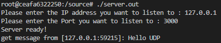
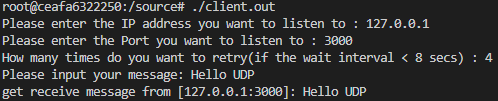
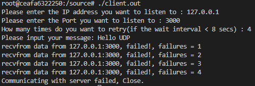
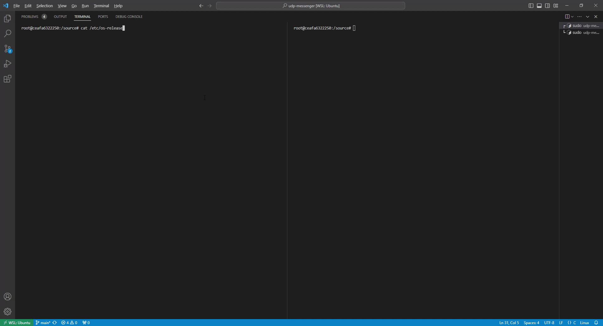

# UDP Messenger

## Introduction
This is a simple UDP echo program. There are 2 roles, server and client. Server will listen to specific IP:Port. Once it receive the messages, it will return the same message to the source. Client can send the messages to server via IP:Port and can assign the max retry times. The max retry function is followed the `exponential backoff algorithm`.

## Build in Debian 10
```bash
$ apt update 
$ apt install make gcc
$ cd /udp-messenger
$ make
```

There will generate 2 executables `server.out` and `client.out` after `make`. You need to run the `server.out` first for listening to the port, then run `client.out` to send the messages. Here is the results below.


* Server  


* Client (Connected)   

* Client (Failed)  



## Demo Video
Here is the demo video for `udp-messanger`. The original video is in the `images/demo.mp4`.  


## uninstall
```bash
$ make clean
```